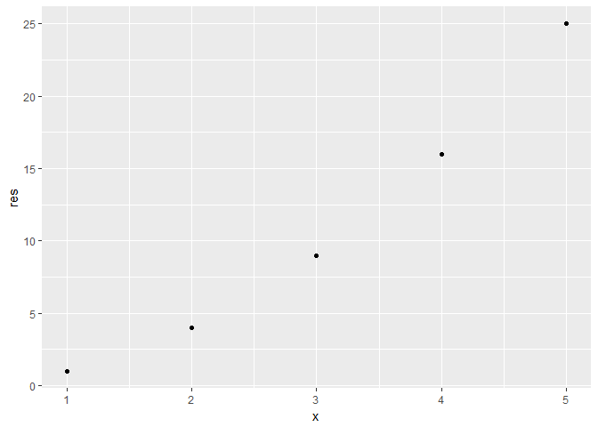
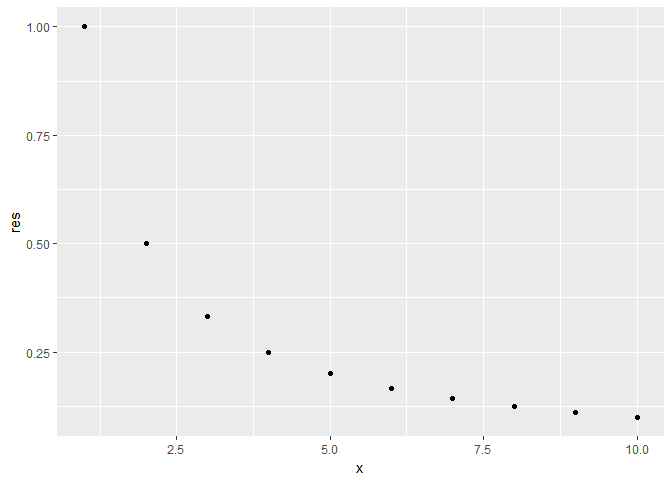

<!-- README.md is generated from README.Rmd. Please edit that file -->
To go back to my progress report...
[link to the README.md of hw09](https://github.com/bcahn7/STAT547M-hw-An-Byeongchan/blob/master/hw09/README.md)

powers
======

This is an R package that provides power functions. The goal of powers is to make it easier to calculate power functions.

Installation
------------

You can install powers from github with:

``` r
# install.packages("devtools")
devtools::install_github("bcahn7/STAT547M-hw09-powers")
#> Downloading GitHub repo bcahn7/STAT547M-hw09-powers@master
#> from URL https://api.github.com/repos/bcahn7/STAT547M-hw09-powers/zipball/master
#> Installing powers
#> "C:/PROGRA~1/R/R-34~1.1/bin/x64/R" --no-site-file --no-environ --no-save  \
#>   --no-restore --quiet CMD INSTALL  \
#>   "C:/Users/Byeongchan/AppData/Local/Temp/RtmpIJmNxq/devtools29c477225ce0/bcahn7-STAT547M-hw09-powers-e0009a7"  \
#>   --library="C:/Users/Byeongchan/Documents/R/win-library/3.4"  \
#>   --install-tests
#> 
```

Example
-------

This is a basic example which shows you how to solve a common problem:

``` r
## basic example code
powers::cube(3)
#> [1] 27
powers::reciprocal(1:5)
#> [1] 1.0000000 0.5000000 0.3333333 0.2500000 0.2000000
```

It has additional function to print out a scatter plot! The default value for the argument `plot_it` is `FALSE`.

``` r
## printing out a scatter plot!
powers::square(1:5, plot_it = TRUE)
```



    #> [1]  1  4  9 16 25
    powers::reciprocal(1:10, plot_it = TRUE)



    #>  [1] 1.0000000 0.5000000 0.3333333 0.2500000 0.2000000 0.1666667 0.1428571
    #>  [8] 0.1250000 0.1111111 0.1000000

In addition, it has an argument for `na.omit`. This is an option to remove `NA`s from an input vector. The default value is `FALSE`.

``` r
powers::cube(c(1,2,3, NA, 5, 6, NA, 8), plot_it = FALSE, na.omit = TRUE)
#> [1]   1   8  27 125 216 512
powers::four(c(1,2,3, NA, NA ,NA), na.omit = TRUE)
#> [1]  1 16 81
```

This `powers` package also has a `boxcoxt` function which print out the one-parameter Box-Cox transformation.
This function does not calculate the optimal lambda value. Using `boxcox()` in the `MASS` package is recommended for the optimal lambda. The default value of lambda is 0.1

``` r
powers::boxcoxt(5:10)
#> [1] 1.746189 1.962312 2.148140 2.311444 2.457309 2.589254
powers::boxcoxt(1:10, lambda = 0.3)
#>  [1] 0.0000000 0.7704814 1.3012972 1.7190552 2.0688553 2.3725662 2.6426332
#>  [8] 2.8868866 3.1106068 3.3175410
```

For convenience, there are two datasets in `powers` package. Those datasets are `1:10`, `-(1:10)`

``` r
powers::tenvec
#>  [1]  1  2  3  4  5  6  7  8  9 10
powers::negtenvec
#>  [1]  -1  -2  -3  -4  -5  -6  -7  -8  -9 -10
```

For Developers
--------------

Use the internal `pow` function as the machinery for the front-end functions such as `square`, `cube`, `four`, and `reciprocal`.
